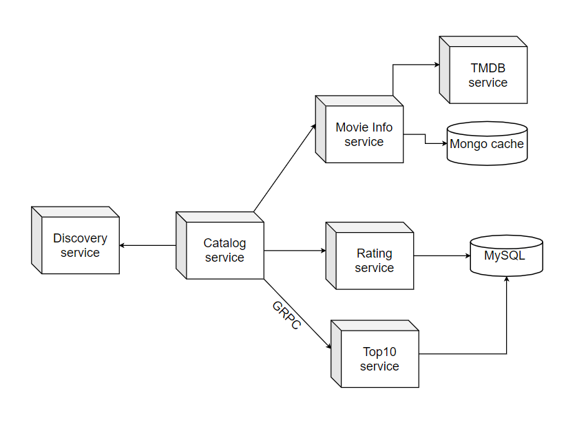

# spring-boot-microservices
In this project, multiple microservices communicate with each other to provide the backend services of a minimalistic/sample movie rating application similar to IMDB.

## Technologies

- Spring Boot
- Spring Cloud Eureka (Service Discovery)
- Spring Cloud Hystrix (Dashboard, Circuit Breaker pattern, Bulkhead pattern)
- Spring GRPC

## Summary

*  __MovieInfoService__ provides the movie info by sending requests to a cache database (MongDB) or to __TheMovieDB API__. 
* __RatingsDataService__ provides the user's ratings for movies.
* __TopRatingGRPCService__ provides the user's ratings for movies.
* __MovieCatalogService__ acts as an accumulator that gets data from __RatingsDataService__ and __MovieInfoService__ to present it.
* __DiscoveryServer__ is the Eureka server for service discovery.

** System architecture

## Running

You can run each project either using your IDE or *mvn spring-boot:run* starting from __DiscoveryServer__ or running runAll.bat. Projects will run on the following endpoints:

* Discovery Server - http://localhost:8761
* Movie Catalog - http://localhost:8081/catalog/{userId}
* Movie Info - http://localhost:8082/movies/{movieId}
* Ratings Data - http://localhost:8083/ratings/{userId}
* Hystrix Dashboard - Go to http://localhost:8081/hystrix. Then enter *https://localhost:8081/actuator/hystrix.stream* to the inputbox.
